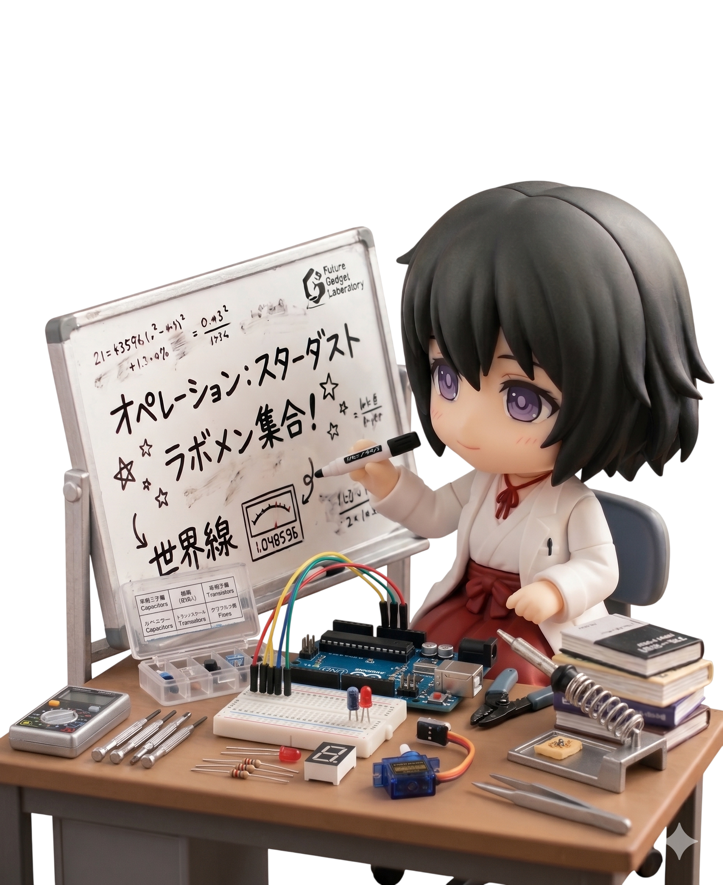

 

# Hello, I'm Yao

<table>
  <tr>
    <td width="70%" valign="top">
      <h3>Background</h3>
      <ul>
        <li><b>Current Focus:</b> Advanced Python, asynchronous design, database optimization, and schema management.</li>
        <li><b>Actively Learning:</b> Deep-diving into AI Engineering and LangChain to integrate LLMs into core backend workflows.</li>
      </ul>
    </td>
    <td width="30%" valign="middle" align="center">
      
    </td>
  </tr>
</table>

---

### Tech Stack & Tools

  &nbsp;&nbsp;
  &nbsp;&nbsp;
  &nbsp;&nbsp;
  &nbsp;&nbsp;
  &nbsp;&nbsp;
  &nbsp;&nbsp;
  &nbsp;&nbsp;
  

---

### Contact & Connect
* **X (Twitter):** [@maho_0xff](https://x.com/maho_0xff)
* **Instagram:** [maho_0xff](https://www.instagram.com/maho_0xff)
* **Leetcode:** [maho_0xff](https://leetcode.com/u/maho_0xff)
